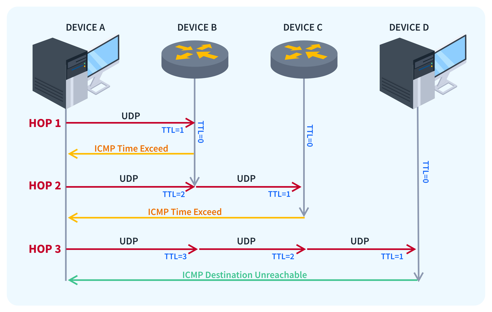
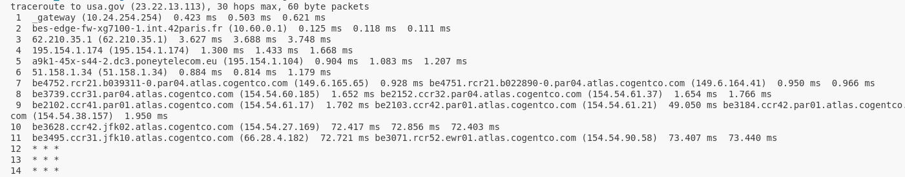
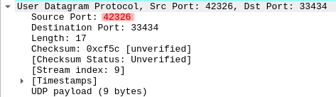
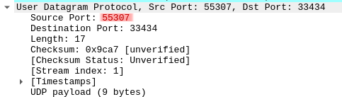
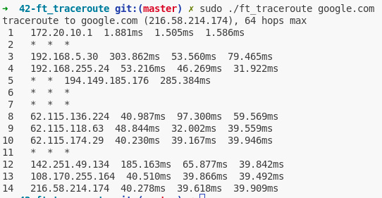
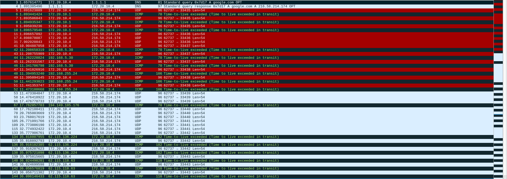

# ft_traceroute

## Principle

The traceroute program is used to trace a packet path to a network host. The GNU **traceroute** program from *inetutils* by default, works by sending an **UDP** datagram (you can also choose to use an **ICMP** *echo*) to the network host (called **probe**). At the beginning, the **TTL** (time-to-live) of the probes are set to 1 : everytime a router will receive an IP datagram, the **TTL** value is going to be decremented.

If the **TTL** value is equals to *zero*, the packet will be discarded, and an error is gonna be reported to the sender, and this where the **ICMP** protocol comes into play ; for such error, an ICMP of type 11 (*Time Exceeded*) code 0 (*Time-to-Live Exceeded in Transit*) is send back to the origin IP.

By incrementing the **TTL** value of the probes, we will in theory, receive for each router crossed by the packet, an **ICMP** *error message*, and we will be able display the IP address of the router.
Each router encountered is called a **hop**, and the time taken to reach the router and receiving the ICMP error message is called the **RTT** (Round-Trip Time).

If a probe reach the destination and if the port **is not in use** on the network host, we should receive an ICMP of type 1 (*Destination Unreachable*) code 3 (*Port Unreachable*), ending the traceroute program :



By default, the **traceroute** program sends 3 probes per hop, and each time an ICMP error message for a probe is received, the packet RTT is displayed. If the response message is not seen under *3 secondes*, the programs prints an `*`.



The algorithm is very simple to understand ! But, there's...

## Many things to consider for a robust traceroute :

UDP is a simple, unreliable datagram protocol. There'is absolutly no guarantee that such datagram ever reach their intended destination, and received in the order they are sent. For this reason, we've to to use several tecnic to ensure the robustness of the program.

Also, by opening an ICMP socket with the `socket` syscall (`socket(AF_INET, SOCK_RAW, IPPROTO_ICMP)`), the kernel will pass to the user-process all the ICMP messages received by the host, and that includes ICMP messages not related to the **traceroute** program.

### The content of an ICMP Error Message

<ins>Each ICMP error message is mandated to contains :</ins>


- The original IP header of the packet that caused the error.
- The first 8 bytes of the original datagram that caused the error.

By reading the ICMP error message content, we can see :

- If the ICMP message is not of type 11 code 0.
- If failed ip packet transport protocol is not UDP.

### The Source Port of the UDP Datagram

But this is not enough : what if another program on host computer, sent UDP datagram to the same network host, like another **traceroute** running in parralel for example, and lead to a router sending ICMP type 11 code 0 for both instance, how can we differenciate and choose the right one ?

To treat this issue, the technique is to **bind** a particular port to the outgoing datagram instead of using an *ephemeral* one : in order to do so, we take the 16 bit value of the **PID** of the **traceroute** process instance, and set the high order byte to one. Translated to C code using the `getpid()` syscall, this gives :

```
source_port = htons((getpid() & 0xFFFF) | (1 << 15))
```

The reason for setting the high order byte to one is to fall between the *Private Ports* range 49152-65535, or *User Ports* (1024-49151) ([IANA](https://www.iana.org/assignments/service-names-port-numbers/service-names-port-numbers.xhtml)).

This way, we can easely identify if an ICMP error message is indeed coming from our **traceroute**.

If we launch the *GNU inetutils* **traceroute** distinctively two times and examine the packets with [Wireshark](https://www.wireshark.org/), we can see that the source port is different :




Do you think you're out of the woods ? There's still two **issue**.

### Not mixing probes response from different hops...



Let's take a look at the above screenshot :

- On the first hop, the distant router received our probes and sent back the ICMP error message.
- On the second hop, the distant router didn't answered to our probes : each `*` means a timeout : the router didn't send back any ICMP error message within the 3 seconds delay. Do consider that the message is maybe still in transit, or lost...
- On the third hop, same as the first, but, imagine some IMCP error message for the second hop are still in transit, and we receive them while looping on the third hop, we could mix up the ICMP messages.

What could we use to avoid this... ? The **destination port** of the UDP datagram.

This the Wireshark capture of the **traceroute** we did on the last screenshot :



> *(the DNS packet is a result of calling `getaddrinfo`...)*

We can see that for a hop **n**, the destination port is set to **33434 + n**. So, if we're on the *n* hop, and we receive an ICMP error message content with the destination port set to **33434 + n - 1**, we can discard it as it's not related to the current hop.

This also solves the issue of the network host already using the destination port : since we increment for each hop, there're is a good chance that we might came across a free port and receive the **Destination Unreachable**, **Port Unreachable** ICMP message. If we were to use the same port **p** for all the probes, and the network host is using **p**, we would never receive such ICMP message, and the program would loop indefinitely.